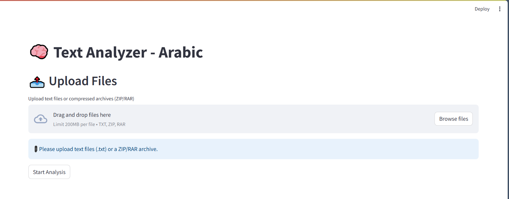
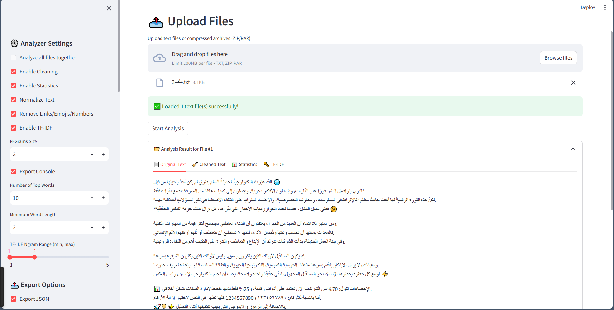
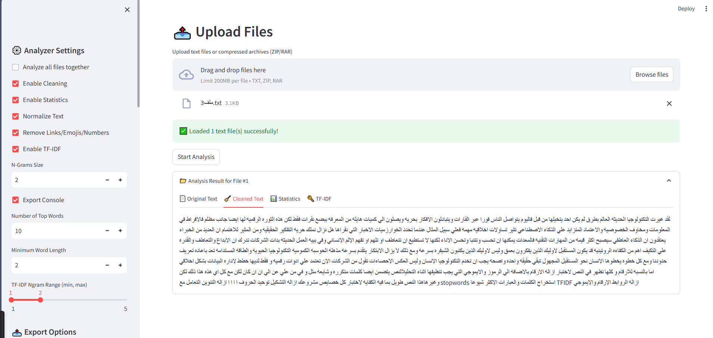
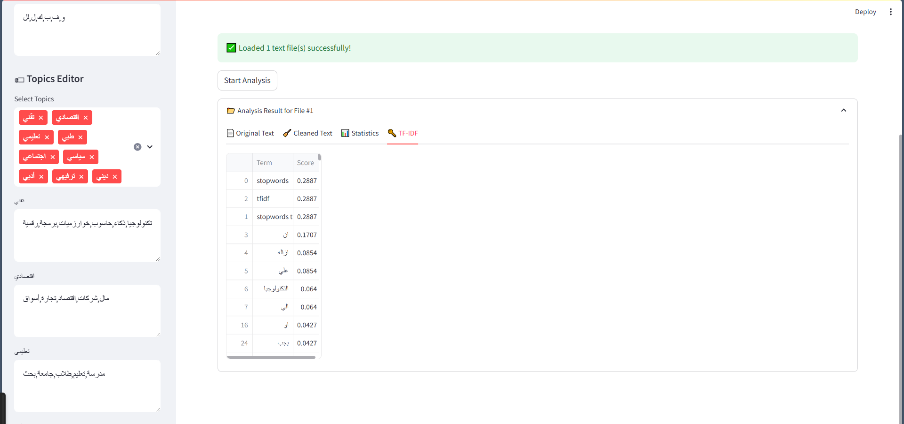

# Text Analytics Pipeline
## Example UI
<p float="left">
  
  
  
  
  
</p>

[](https://www.python.org/)
[](https://streamlit.io/)
[](LICENSE)

## Overview
**Text Analytics Pipeline** is an advanced, modular, and user-friendly platform for analyzing textual content.  
It allows users to upload text files (or compressed archives), preprocess the text, extract useful statistics, and perform linguistic analysis such as:
- Word and character count
- Average word length
- Popular words and phrases
- Stopwords filtering
- TF-IDF scores
- Language detection and separation (Arabic / English)
- Data export (CSV, JSON, Excel)

This project is **educational and professional**: designed to teach best practices in Python, text processing, and modular application architecture.

---

## Features
-  Upload multiple `.txt` files or compressed archives (`.zip`, `.rar`)
-  Automatic text cleaning: remove punctuation, diacritics, emojis, numbers, and links
-  Split text by language (Arabic / English)
-  Stopwords removal with prefix handling
-  Compute TF-IDF scores and identify key phrases
-  Export results as JSON , CSV and EXCEL 
-  Full logging for debugging and reproducibility
-  Modular code structure: `ui`, `analyzer`, `utils`, `exporters`

---

## Installation

**Prerequisites**
- Python 3.9+
- pip

**Clone the repository**
```
git clone https://github.com/yourusername/text-analytics-pipeline.git
cd text-analytics-pipeline
```

**Install dependencies**
pip install -r requirements.txt

### Usage
Run the Streamlit app:
```streamlit run ui/app.py```

Then, in your browser:
- Upload one or multiple .txt files, or a .zip/.rar archive containing text files.
- Review the extracted statistics.
- Export results as CSV or JSON.


###   Project Structure
```
TEXT_ANALYTICS_PIPELINE/
├── analyzer/
│   └── text_analyzer.py
├── exporters/
│   └── export_analyze.py
├── logs/  
├── outputs/  
├── ui/
│   ├── app.py
│   ├── file_uploader.py
│   ├── result_viewer.py
│   └── sidebar.py
├── utils/
│   ├── logger.py
│   └── utils.py
├── .gitignore
├── cli.py
├── config.json
├── README.md
└── requirements.txt
```

###   Example Output
 Original Text
 Cleaned Text
 Statistics:
 ```
        Words Count
        262
        Characters Count
        1567
        Average Word Length
        4.98
        Most Popular Word
  علي
        Text Topic
        تقني
Most popular words: ["تكنولوجيا", "الذكاء", "العاطفي"]
TF-IDF top keywords: ["رقمي", "مستقبل", "إبداع"]
```


###   Technologies & Libraries
- Python 3.9+
- Streamlit (Web UI)
- scikit-learn (TF-IDF)
- pandas & numpy (data processing)
- regex & emoji (text cleaning)
- zipfile & rarfile (compressed archives)


###   Contributing
Contributions are welcome!
Feel free to fork the repository, submit issues, or open pull requests.


###   License
This project is licensed under the MIT License - see the LICENSE
 file for details.


###   cAuthors
Abdulmoneim Omar – Python Developer | AI Enthusiast

